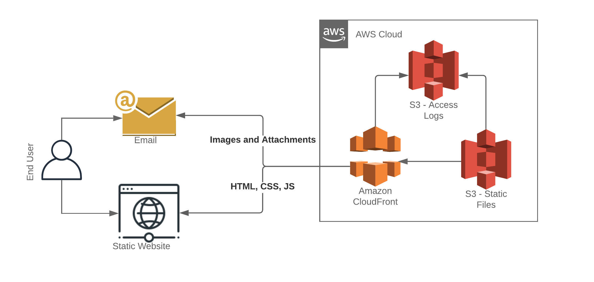

# simple-cms
Cloudformation template to deploy an S3 bucket along with CloudFront Distribution to allow for simple hosting of images and attachments for Pinpoint emails, Hosting a static website, or other file hosting needs.

WARNING! - ANY FILES UPLOADED TO THIS CMS WILL BE AVAILABLE TO THE PUBLIC.  DO NOT USE THIS TO STORE ANY THING YOU WOULDN'T WANT THE ENTIRE WORLD TO SEE.  THIS SHOULD ONLY BE USED TO HOST IMAGES/FILES YOU WOULD WANT TO INCLUDE IN EMAILS AND PUBLIC WEBSITES.

## Install
- Deploy CloudFormation Template.  There are no parameters.
- Once Deployment is complete open the Outputs tab of the Cloud Formation Stack
- Deploy files to the S3 bucket indicated on the Outputs tab
- Use the SimpleCMSURL to prefix any files uploaded to S3

## Caching
This solution uses Cloudfront to quickly serve files from edge locations located close to your end users.  By default the files are cached for 1 hour.  If you upload files to S3 and don't see any changes you will need to [invalidate the cache](https://docs.aws.amazon.com/AmazonCloudFront/latest/DeveloperGuide/Invalidation.html) to see updates.

If needed you can also adjust the 1 hour cache to a different value by [modifying the Default TTL](https://docs.aws.amazon.com/AmazonCloudFront/latest/DeveloperGuide/Expiration.html)

## Notes
- The associated S3 bucket will have [S3 file versioning enabled](https://docs.aws.amazon.com/AmazonS3/latest/dev/manage-objects-versioned-bucket.html).  If you need to roll back or change versions you can easily do so via the S3 console.
- All S3 and CloudFront access will be logged to a separate S3 Logging Bucket for auditing purposes.
- [Custom Domain Name](https://docs.aws.amazon.com/Route53/latest/DeveloperGuide/routing-to-cloudfront-distribution.html)
- Secure Headers - This architecture does not implement Secure Headers.  That maybe a concern if you are using this to host a static website.  This can easily be fixed using Lambda@Edge.  [More Information](https://aws.amazon.com/blogs/networking-and-content-delivery/adding-http-security-headers-using-lambdaedge-and-amazon-cloudfront/)